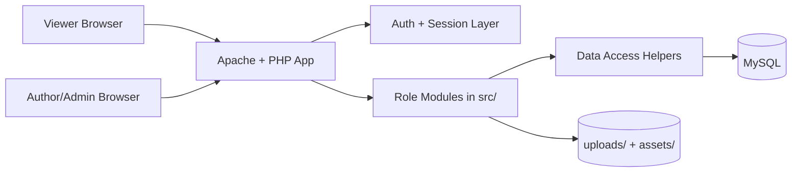

# Quill - Role-Based Blogging Platform

## Overview
Quill is a PHP + MySQL blogging platform with role-based workflows for **viewer**, **author**, and **admin** users. It demonstrates end-to-end web engineering fundamentals: authentication, content lifecycle management, media handling, and dashboard-oriented operations.

## Problem Statement
Most beginner blog projects only cover basic CRUD and miss role separation, moderation workflows, and operational readiness. Quill addresses this by implementing a multi-role publishing workflow with clean separation between public browsing and protected author/admin operations.

## Solution Overview
Quill uses server-rendered PHP views backed by MySQL (PDO). Authentication and authorization gates users into role-specific modules. Authors create and manage posts, admins oversee users/content, and viewers consume published content.

## Features
- Role-based access control (`viewer`, `author`, `admin`)
- Authentication and session-based authorization
- Author workflows: create, edit, publish/draft posts
- Admin workflows: dashboard and user/content oversight
- Tagging and featured image support
- Public viewer pages for published articles

## Architecture
Application modules are organized by role and shared includes:
- `index.php`: entry and route switching
- `src/auth`: login/auth handling
- `src/author`: author dashboards and post operations
- `src/admin`: admin management dashboards
- `src/viewer`: public content pages
- `includes/config.php`: environment and DB bootstrap
- `includes/functions.php`: shared utilities/data access helpers

## Tech Stack
- PHP 8+
- MySQL 8+ (PDO)
- HTML/CSS/Bootstrap-style UI
- Apache/XAMPP local runtime

## Architecture Diagram

## Setup Instructions
1. Clone repository into XAMPP htdocs.
2. Copy `.env.example` to `.env` and set DB values.
3. Create database and import `docs/schema.sql`.
4. Start Apache and MySQL from XAMPP.
5. Open `http://localhost/quill`.

## Usage
- Sign in via auth flow.
- Create/edit posts from author dashboard.
- Manage users/content from admin dashboard.
- Review published posts from viewer pages.

## API / Data Layer Notes
Quill is server-rendered and does not expose a standalone REST API. Data operations are centralized in PHP utility functions under `includes/functions.php`.

## Screenshots
- `docs/screenshots/home.png` (placeholder)
- `docs/screenshots/author-dashboard.png` (placeholder)
- `docs/screenshots/admin-dashboard.png` (placeholder)

## Deployment
See `docs/DEPLOYMENT.md` for local and production deployment steps.

## Future Improvements
- CSRF middleware across all state-changing routes
- Form request validation abstraction
- Unit/integration tests for auth and publishing workflows
- Structured logging and audit trails
- Optional REST API for headless clients

## Contributing
See `CONTRIBUTING.md` for development workflow and quality expectations.

## License
MIT
